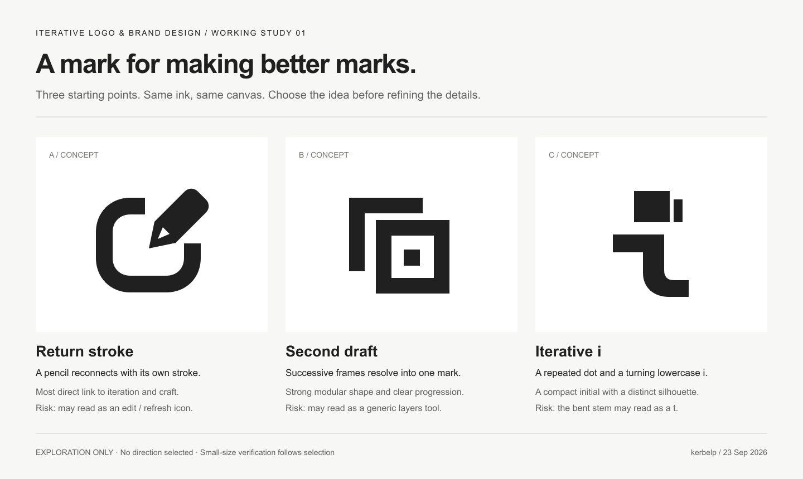
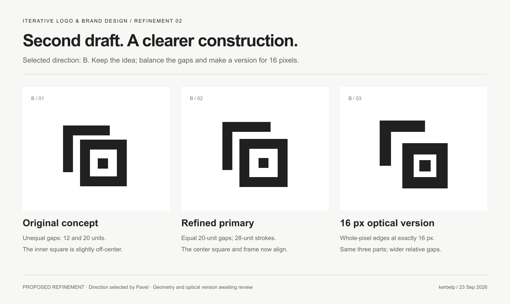

# Iterative Logo and Brand Design

An independent agent skill maintained by [kerbelp](https://github.com/kerbelp) for developing and refining logos and brand identities through exploration, feedback, and practical reproduction tests.

The workflow adapts to exploration, refinement, or production work. It compares concepts fairly, distinguishes concept previews from editable artwork, and checks exported assets at their intended sizes and uses. Approved choices stay intact as the design evolves, with a short decision log for longer projects.

## Use it

Clone this repository:

```sh
git clone https://github.com/kerbelp/iterative-logo-brand-design.git
```

The repository root is the skill folder: [SKILL.md](SKILL.md) contains the workflow. Place the complete folder in the skills directory supported by your agent, or ask your agent to read and follow `SKILL.md` directly. Installation and skill discovery depend on the agent you use.

Start with a brief, for example:

> Use iterative-logo-brand-design to explore a logo for a neighborhood bicycle repair shop called Second Spin. It should feel friendly, practical, and durable. Explore three distinct directions, then help me choose one before refining it. It needs to work on a storefront, a social avatar, and a one-color repair tag.

For an existing identity, attach the current assets and explain what to preserve. The workflow calls for visual previews, editable SVG assets where appropriate, and size and color checks; the tools available to your agent determine which artifacts it can produce.

For a focused revision, try:

> Refine the attached mark for use as a 16–32 px favicon. Preserve the outer silhouette and approved colors; simplify only the inner detail. Show the before and after at actual sizes, deliver an editable SVG, and report which exports you inspected and any remaining limitations.

The skill keeps work proportional to the request: exploration can stop at rough concepts, a small edit stays focused, and a production handoff records completed checks and unresolved issues.

## The skill designs its own logo

We are using this workflow to create the repository's identity and document real decisions along the way. After comparing three directions, Pavel selected **B — Second draft** and approved its refined primary geometry. The second round also checks a dedicated 16 px version. Color, typography, and the final identity are still in progress.





These images are local renders of editable SVG artwork, not Figma screenshots. [Follow the brief, decisions, pixel checks, and next steps](examples/self-branding/README.md), or [inspect the original SVG comparison board](examples/self-branding/01-exploration/contact-sheet.svg). The example now also includes [three color studies and a browser screenshot of their comparison](examples/self-branding/03-color/README.md).

## Files

- [`SKILL.md`](SKILL.md) — the reusable workflow.
- [`agents/openai.yaml`](agents/openai.yaml) — agent interface metadata and a default prompt.
- [`assets/icon.svg`](assets/icon.svg) — the skill icon.
- [`LICENSE`](LICENSE) — MIT license.

## Inspiration

Allan Peters’ work inspired this independent workflow, alongside common professional identity-design practices. It is not his official method, a transcription of his material, or affiliated with or endorsed by Allan Peters or Peters Design Co. See [Peters Design Co](https://www.petersdesigncompany.com/) and his book, [Logos That Last](https://www.petersdesigncompany.com/book), for his own work.

## License

Released under the [MIT License](LICENSE). Linked third-party works remain the property of their respective owners.
