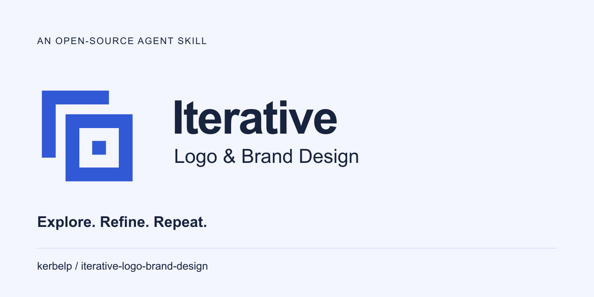

# Cobalt & chalk

The repository identity uses the approved **Second draft** mark and the selected **Cobalt & chalk** palette. The delivered name lockup carries forward the Arial treatment shown with that palette. [The worked example](../../examples/self-branding/README.md) records the user decisions and verification.

## Files

| Use | File |
| --- | --- |
| README / light header | [header-light.svg](header-light.svg) |
| Dark header | [header-dark.svg](header-dark.svg) |
| GitHub social preview | [png/social-preview.png](png/social-preview.png) — 1280 × 640 px, under 1 MB |
| Social preview vectors | [social-preview.svg](social-preview.svg) — outlined; [source/social-preview.svg](source/social-preview.svg) — editable text |
| Cobalt mark on a light surface | [mark-primary.svg](mark-primary.svg) |
| Pale cobalt mark on ink | [mark-dark.svg](mark-dark.svg) |
| Single-color dark / white | [mark-mono.svg](mark-mono.svg), [mark-white.svg](mark-white.svg) |
| Exactly 16 px, light / dark | [micro-primary.svg](micro-primary.svg), [micro-dark.svg](micro-dark.svg) |
| Exactly 16 px, dark ink / white | [micro-mono.svg](micro-mono.svg), [micro-white.svg](micro-white.svg) |
| Skill tile with fixed chalk background | [../icon.svg](../icon.svg) |
| Tile for exactly 16 px | [../icon-16.svg](../icon-16.svg) |
| Raster exports | [png/](png/) — icon sizes 16, 24, 32, 64, 128, 256, and 512 px; both headers at 960 × 280 px |
| Editable live-text header sources | [source/header-light.svg](source/header-light.svg), [source/header-dark.svg](source/header-dark.svg) |
| Palette and type data | [palette.json](palette.json) |

Delivery headers contain outlined lettering and do not require fonts at display time. Their paths remain editable. The text sources use Arial Bold and Arial Regular, with Helvetica and sans-serif fallbacks; install the intended font locally when editing text. No font files are included.

## Usage

- Use the optical artwork at exactly **16 px**. Use the primary at **24 px and above**. Other sizes below 24 px need an actual-size check before use.
- Both agent interface icon slots point to the primary tile, because the consuming application's display size is not guaranteed to be 16 px. Use the dedicated 16 px asset when the output size is known.
- Keep the supplied square canvas and proportions. Its padding meets the suggested clear space of one primary stroke width: 28 units on the 256-unit canvas, measured from visible artwork to unrelated content.
- Use the full header at **480 px wide or larger** for routine reading; its descriptor is then 14 px high before font metrics. At smaller widths, use the standalone mark with normal page text instead of shrinking the whole lockup.
- Use cobalt on chalk and pale cobalt on ink. For other backgrounds, use the fixed chalk tile or verify contrast before using a transparent mark.
- Keep the three mark parts in one color. Preserve the central square and the frame gaps. Avoid stretching, gradients, outlines, and shadows that alter the silhouette or fill the small openings.

The horizontal lockup uses approximately one primary-stroke width or more of separation between the mark and text. The supplied files establish the alignment; preserve it when placing them.

## GitHub social preview

Upload `png/social-preview.png` in the repository's **Settings → General → Social preview → Edit → Upload an image**. Committing the image does not apply this setting. GitHub's [social preview instructions](https://docs.github.com/en/repositories/managing-your-repositorys-settings-and-features/customizing-your-repository/customizing-your-repositorys-social-media-preview) describe the separate upload step.

## Palette

| Role | Color |
| --- | --- |
| Chalk / light surface | `#F3F5FF` |
| Ink / text and dark surface | `#18233E` |
| Cobalt / light-surface mark and UI accent | `#3159D6` |
| Pale cobalt / dark-surface mark | `#AFBFFF` |

Measured contrast: ink/chalk **14.32:1**; cobalt/chalk **5.47:1**; pale cobalt/ink **8.69:1**. These measurements apply to those pairs, not every combination in the palette.

## Verification and limits

[Delivery checks](../../examples/self-branding/04-delivery/README.md) cover named digital sizes, light/dark surfaces, font-independent header rendering, and application previews. Print reproduction and installed-agent rendering have not been tested. Use the monochrome vector when a print workflow requires one, and proof it with that provider.
