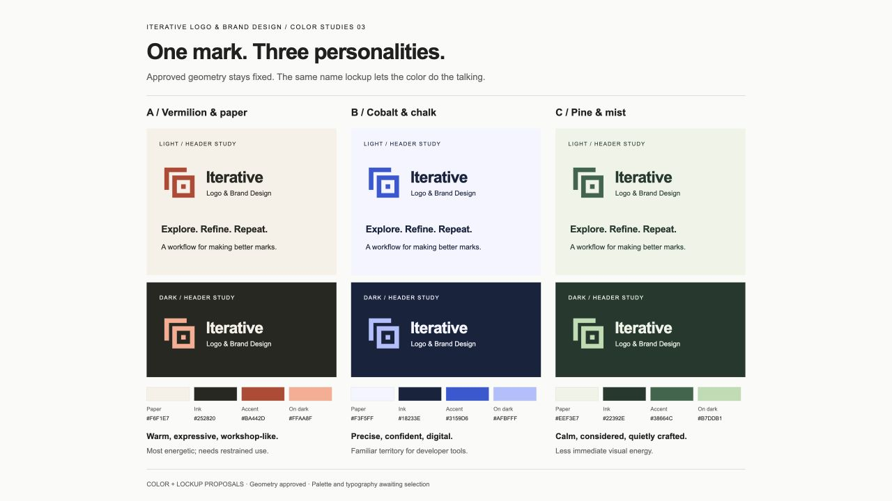

# Round 3 — Color and name lockup

Status: three proposals, awaiting selection. The refined primary geometry remains approved and unchanged.

This is an actual browser screenshot of the [local study page](index.html), captured on 23 September 2026. The page displays the [editable SVG comparison board](color-studies.svg), fitted to the viewport. It is not a Figma screenshot or a screenshot of the live GitHub README. A [full-resolution local render](color-studies.png) is also available for closer inspection.

## Keep the comparison fair

All three options use the same mark paths, scale, spacing, and name lockup. Only the color roles change. The complete name remains **Iterative Logo & Brand Design**; “Second draft” is the concept name, not a proposed project rename.

| Option | Character | Tradeoff |
| --- | --- | --- |
| A — Vermilion & paper | Warm, expressive, workshop-like | Strongest accent; use it sparingly around content |
| B — Cobalt & chalk | Precise, confident, digital | Familiar territory for developer tools |
| C — Pine & mist | Calm, considered, quietly crafted | Less immediate visual energy |

**Agent recommendation:** A. Its warm paper and vermilion give the geometric mark a more approachable character. This is a recommendation, not user approval.

## Proposed typography

The lockup uses **Arial Bold** for “Iterative” and **Arial Regular** for “Logo & Brand Design”. Both font families and styles were verified locally with `fc-match`; Inter was not available and was not silently substituted. The leading word has slightly tightened tracking and a larger size to keep the full project name readable without squeezing it onto one line.

These SVG sources contain live text with Helvetica and generic sans-serif fallbacks. Their lettering may change where Arial is unavailable. No font files are distributed. After the lockup is selected, prepare a portable outlined version alongside the editable source and inspect both before final delivery. Typeface selection remains open.

## Color roles and measurements

Paper is the light surface, ink is the text and dark surface, accent colors the mark on paper, and a separate lighter accent colors it on the dark surface. The monochrome sources remain available in Round 2.

| Option | Paper | Ink / dark | Accent on paper | Accent on dark |
| --- | --- | --- | --- | --- |
| A | `#F6F1E7` | `#252820` | `#BA442D` | `#FFAA8F` |
| B | `#F3F5FF` | `#18233E` | `#3159D6` | `#AFBFFF` |
| C | `#EEF3E7` | `#22392E` | `#38664C` | `#B7DDB1` |

Relative-luminance contrast ratios computed from the exact sRGB values:

| Option | Ink on paper / paper on ink | Accent on paper | Lighter accent on dark |
| --- | --- | --- | --- |
| A | 13.30:1 | 4.72:1 | 8.12:1 |
| B | 14.32:1 | 5.47:1 | 8.69:1 |
| C | 10.99:1 | 5.86:1 | 8.27:1 |

These values describe the named color pairs, not every possible use of the palette. Live application and small-size color checks will follow selection. [Palette values and measurements](palettes.json) are also available as data.

## Editable lockup studies

- A: [light](vermilion-lockup-light.svg), [dark](vermilion-lockup-dark.svg).
- B: [light](cobalt-lockup-light.svg), [dark](cobalt-lockup-dark.svg).
- C: [light](pine-lockup-light.svg), [dark](pine-lockup-dark.svg).

The header panels are illustrative studies, not installed UI. Both the local render and browser capture were visually inspected for clipping, alignment, and readable hierarchy. The embedded mark paths were checked against the approved primary SVG. No palette has been installed as the active skill icon.
