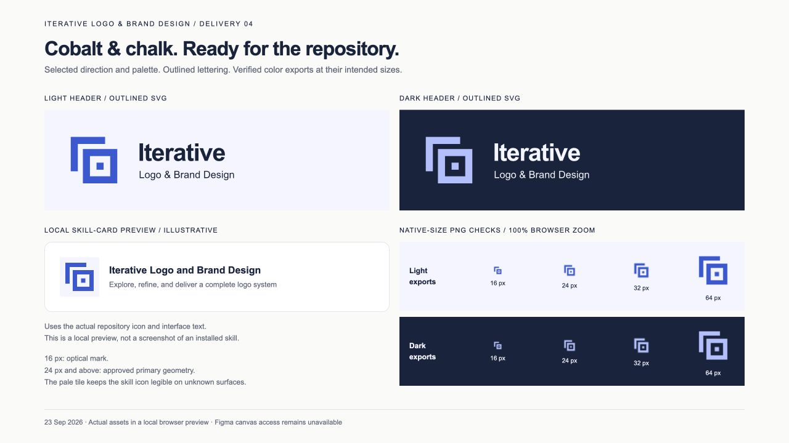
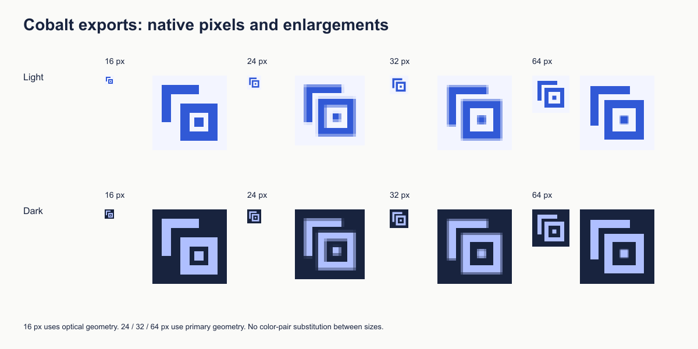

# Round 4 — Cobalt & chalk delivery

**User decision:** “Lets go with B”, selecting the Cobalt & chalk treatment after the primary mark had already been approved. The final files retain the shown Arial name lockup; the user did not separately request a typeface change.

This is an actual browser screenshot of [the local delivery page](index.html), captured on 23 September 2026. It displays the delivered SVGs, PNG exports, and an illustrative skill card using the repository icon and interface text. It is not a screenshot of an installed agent interface or Figma.

## Delivered

- [Brand assets and usage guide](../../../assets/brand/README.md): primary and 16 px optical vectors in color, dark-surface, dark-ink, and white forms.
- Font-independent light and dark headers with outlined lettering, plus editable live-text sources and PNG exports.
- A new [repository skill icon](../../../assets/icon.svg), a dedicated [16 px tile](../../../assets/icon-16.svg), and PNGs at 16, 24, 32, 64, 128, 256, and 512 px.
- Agent metadata retains its existing behavior and now uses the new icon artwork and selected cobalt brand accent. Both icon slots use the primary tile because their display dimensions depend on the consuming application.
- The README presents the identity and preserves the exploration, refinement, color decision, and delivery views. The former pencil icon is retained as [historical input](../01-exploration/original-pencil-icon.svg).

## Checks performed

| Check | Result |
| --- | --- |
| Approved mark geometry | Standalone primary variants retain the approved paths; color and background change only |
| 16 px light and dark PNGs | Optical geometry retains separate frames and inner square; each PNG has exactly two colors |
| 24, 32, and 64 px light/dark PNGs | All three parts remain distinguishable; fractional-edge antialiasing remains at some sizes, without merging or clipping observed |
| Outlined vs live-text headers | Same composition on visual inspection; normalized pixel RMSE below 0.001 for each theme after Cairo conversion |
| Portable header sources | Delivered header SVGs contain no live text, embedded raster images, or external font dependencies |
| Local browser preview | Light/dark headers, the illustrative skill card, and native-size exports render without clipping in the captured viewport |
| Asset integrity | SVG XML and local links checked; PNG dimensions match filenames; metadata references resolve |

The 16 px tests use optical geometry; all larger icon exports use the primary. Pixel enlargements are only for inspection. Their native PNGs remain alongside this document.

## Limits

The primary shape and palette were explicitly selected. The Arial lockup, clear-space suggestion, and 16 px usage rule are the delivered implementation of the shown design and recorded checks, rather than additional explicit user approvals. The work is verified for the documented digital uses; it has not been physically printed or checked in an installed skill host. Figma MCP canvas access remains blocked by the previously reported plan limit; the empty Figma file is not a source of these assets.
