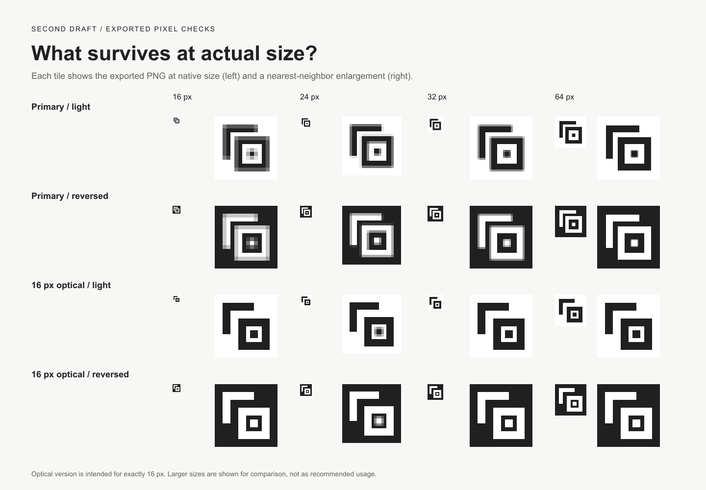

# A logo for the logo-design skill

An ongoing example of using the skill on its own repository. This records the actual exploration and feedback as they happen; it is not a completed case study.

## Brief

The maintainer asked to design a logo collaboratively, use Figma, and include images of the process in the repository. The identity is for **Iterative Logo & Brand Design**, an independent agent workflow for exploring, refining, and verifying logos.

Working assumptions proposed by the agent, awaiting feedback:

- Audience: people using agents for design, including designers and developers.
- Personality: thoughtful, approachable, and precise; explore a craft-focused geometric direction first.
- Uses: a small skill icon and a GitHub README header, with a social preview as a possible later application.
- Preserve the full project name and its independent attribution. The supplied pencil icon remains in place until a replacement is selected and verified.

Compare concepts on distinctiveness, small-size clarity, and how naturally they suggest iterative design. The concept vocabulary is **stroke, return, draft, frame, repetition, and initial**.

## Round 1: concept exploration

All three are original editable SVG sketches shown on equal canvases in the same ink. The board uses Arial with Helvetica and sans-serif fallbacks for presentation text; this is not a proposed brand typeface. The marks themselves contain no live text or embedded bitmaps.

| Direction | Idea | Advantage | Open concern |
| --- | --- | --- | --- |
| [A — Return stroke](01-exploration/a-return-stroke.svg) | A pencil paired with a returning stroke | Immediately communicates drawing and revision | Could read as a generic edit control; the pencil opening needs size tests |
| [B — Second draft](01-exploration/b-second-draft.svg) | Offset frames with a resolved center | Simple modular geometry offers a useful basis for an identity | Could read as a layers tool; spacing needs optical refinement |
| [C — Iterative i](01-exploration/c-iterative-i.svg) | An initial with a repeated dot and turning stem | Offers a compact typographic direction | The stem may read as a t, and the repeated dot may disappear at small sizes |

**Initial agent recommendation:** explore B first for its modular construction and potential to extend into a visual system. A is the most immediately literal option; C needs more work on letter recognition.

**User decision:** “lets go with B”. The following round preserves the overlapping-frame concept.

## Round 2: refine Second draft

The original had a 12-unit gap above the foreground frame and a 20-unit gap to its left. The refined primary uses 20-unit gaps in both directions, consistent 28-unit strokes, and a centered inner square on a 256-unit canvas. These changes keep the selected idea while making its construction more consistent.

**User decision:** “refined looks good”. The refined primary geometry is approved and will stay fixed during color and typography exploration. The board above preserves the earlier review state rather than rewriting the process history.

Direct scaling softens the primary's edges at 16 px. A dedicated optical variant uses whole-pixel coordinates, 2 px strokes, and a 2 px inner square with 1 px of surrounding negative space. It is intended for exactly 16 px; the primary remains the proposal for 24 px and above. These are candidate usage rules awaiting review, not a finished brand specification.

The board pairs each native-size PNG with an enlargement of those same pixels. At smaller display widths the page may scale the whole board; open the individual PNGs to inspect their native dimensions. Enlargements use integer scale factors, so the 24 px enlargement is 120 px rather than 128 px.

- [Refined primary SVG](02-refinement/b-primary.svg) and [white reversed SVG](02-refinement/b-primary-reversed.svg).
- [16 px optical SVG](02-refinement/b-micro-16.svg) and [white reversed SVG](02-refinement/b-micro-16-reversed.svg).
- [Raster exports](02-refinement/exports) and [verification record](02-refinement/verification.md).

The optical version is also rendered at larger sizes for comparison; that does not change its proposed 16 px usage threshold. The existing skill icon has not yet been replaced.

## What has actually been checked

- Both rounds were rendered locally with `rsvg-convert` and visually inspected for spacing, legibility, and clipping.
- Round 2 includes actual 16, 24, 32, and 64 px raster exports on white and dark backgrounds, with nearest-neighbor enlargements for inspection. See the verification record for observed softness and limitations.
- SVG syntax, raster dimensions, and local Markdown image/link targets were checked.
- B and its refined primary geometry are approved. The optical usage rule, color, typography, real application checks, and final handoff remain unfinished.

## Figma status

A [Figma process file](https://www.figma.com/design/jIboEmJ2p9sDszWPKTFtDo) was created on 23 September 2026. The next MCP call hit the account's Starter-plan tool limit before any artwork could be placed, so that file is currently empty. The images above are local SVG renders, not Figma screenshots. File access depends on the owner's Figma sharing settings.

When Figma access is available, import both rounds of SVGs while preserving their history. Add genuine Figma captures to this example as that work happens.

## Next decision

Explore a restrained color palette and name lockup around the approved geometry, then check them in the README and skill-icon context.

See [the decision log](design-decisions.md) for the current state and [the capture index](process-captures.md) for images and captions being preserved for the final README and a possible blog post.
